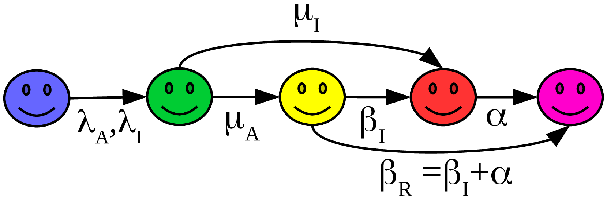

## Modelagem matemática da disseminação geográfica da COVID-19

**Predição, estratégias de mitigação, supressão e distribuição de recursos**

- **Equipe:** [Silvio C. Ferreira](https://sites.google.com/site/silvioferreirajr/home) (coordenador), [Wesley Cota](https://wesleycota.com/), [Guilherme H. S. Costa](https://scholar.google.com.br/citations?user=vJuL8eQAAAAJ&hl=pt-BR)
- [Departamento de Física](https://www.dpf.ufv.br)
- [Universidade Federal de Viçosa (UFV)](https://www.ufv.br)

### Contato

- [Silvio C. Ferreira](mailto:silviojr@ufv.br) - silviojr@ufv.br 
- [Wesley Cota](mailto:wesley.cota@ufv.br) - wesley.cota@ufv.br
- [Guilherme H. S. Costa](mailto:guilherme.h.costa@ufv.br ) - guilherme.h.costa@ufv.br

### Motivação

Como toda epidemia emergente, a COVID-19 apresenta grandes desafios em todas as esferas desde as políticas sanitárias, impactos econômicos e, principalmente, preservação da vida e saúde da população. Um aspecto fundamental em uma nova epidemia é ganhar tempo para o desenvolvimento de vacinas e tratamentos eficazes e, como tornou-se evidente com a COVID-19, adequação da estrutura sanitária e, em particular, a disponibilidade de leitos e equipamentos essenciais para o tratamento. Portanto, encontrar formas de mitigar ou suprimir o surto epidêmico evitando o colapso dos sistemas sanitários é fundamental. Em um primeiro momento, a supressão das interações sociais por meio de quarentenas é única medida capaz gerar segurança epidemiológica. Porém, a médio e longo prazo o colapso econômico e social tornará tais medidas inviáveis. Sendo assim, é fundamental determinar as condições que minimizem simultaneamente tais efeitos colaterais e o risco à população, em especial aos grupos mais vulneráveis. Mesmo após um  sucesso para conter o surto inicial, será necessário um monitoramento contínuo a médio e longo prazo pois novos surtos muito possivelmente ocorrerão após a relaxação das restrições rígidas hoje adotadas.

Neste cenário a modelagem matemática, computacional e estatística tornam-se aliados poderosos para construção de políticas de supressão ou mitigação da epidemia e não tem sido diferente para a COVID-19.[^KraemerSci],[^Arenas2020],[^Lourenco2020],[^Zhang],[^Pullano] Muitos países desenvolvidos como os EUA tratam a previsão de epidemias como uma questão de segurança nacional com centros avançados de modelagem e monitoramento de epidemias.[^mobslab] A abordagem tradicional que vem sendo usada por alguns grupos no Brasil adotam modelos compartimentais em que os indivíduos são agrupados de acordo com o estado epidemiológico: suscetível, infeccioso, exposto, recuperado, etc. [^Barratbook]. Um grande limitante dessa abordagem é que ela assume populações completamente misturadas que, numa escala de país continental como o Brasil, é demasiadamente simplificadora.

### Proposta

A nossa proposta é utilizar modelos de metapopulações em que as populações são agrupadas em subpopulações (*patches*) delimitadas por regiões geográficas, dentro das quais os contágios ocorrem mas existe o fluxo entre indivíduos de diferentes regiões.[^GardenesNatPhy],[^ColizzaRD] Nesta primeira etapa, estamos focando nossos estudos em mobilidade recorrente na qual os indivíduos retornam às suas regiões de residência após visitar outras regiões.[^Balcan] Isso ocorre, por exemplo, com mobilidade pendular em que pessoas de uma cidade estudam ou trabalham em outra. Também podemos incluir o fluxo por vias aéreas ou terrestres. As interações epidêmicas (contágio, cura, morte,  etc.) serão feitas dentro de cada subpopulação usando modelos compartimentais estocásticos. A inspiração para o nosso trabalho é o modelo proposto muito recentemente para o estudo da disseminação da COVID-19 na Espanha [^Arenas2020]. Estamos estudando uma versão estocástica deste modelo determinístico que permitirá calcular margens de confiança para as simulações.

A nossa meta é nuclear um sistema de previsão e monitoramento para a COVID-19 para auxiliar as políticas públicas para o combate à sua disseminação, minimizando impactos econômicos e sociais sem comprometer a segurança sanitária da população, em particular a da porção mais vulnerável. É certo que o relaxamento das restrições adotadas atualmente para a contenção da epidemia vão gerar novas ondas de infecção. Estimamos que essa iniciativa de monitoramento e previsão será necessária por pelo menos dois anos. Além disso, o acompanhamento de outras epidemias poderá ser feito usando o mesmo ferramental desenvolvido aqui.

### Diferencial do nosso projeto

#### Proposta
A maioria dos estudos feitos para predições do COVID-19 no Brasil se baseam em modelos compartimentais simples (veja a descrição do modelo abaixo) baseados em equações diferenciais ordinárias para toda a população envolvida, ou seja, não levam em conta a distribuição demográfica das pessoas. A abordagem que usaremos aqui poderá fornecer um diagnóstico muito mais preciso permitindo intervenções a nível municipal e podendo ser estendidas para nível intra-municipal dadas as necessidades de cada cidade.  Até onde sabemos, não existem estudos similares sendo feitos para o Brasil. O modelo é inspirado em um trabalho que já está suficientemente maduro e pôde descrever com bastante precisão a evolução da epidemia na Espanha, permitindo estudos de sobrecarga de leitos do sistema de saúde.[^covidES] Vale destacar que um dos autores do trabalho espanhol, Wesley Cota, faz parte da nossa equipe.

#### Equipe

A nossa equipe possui grande experiência na área de modelagem de epidemias em redes complexas. O lider do projeto, Silvio Ferreira,  atua na área há mais de 10 anos e já orientou várias teses e dissertações sobre o tema. Os dois outros membros estão em fase avançada de suas teses de doutorado  justamente nesse tema e dominam todas as ferramentas computacionais e analíticas necessárias para o desenvolvimento do projeto. Possuímos também  parceiros especialistas no assunto como os pesquisadores  Alex Arenas (Universidad Rovira i Virgili), Jesus Goméz-Gardenes (Universidad de Zaragoza) e Marcelo Gomes (Fiocruz-RJ). Outros alunos do nosso grupo já treinados  podem ser redirecionados a esse problema, além de ex-alunos, hoje pesquisadores na UFLA, UFOP, UFSJ, que manisferam interesse em contribuir.

### Situação do projeto

A versão brasileira do modelo foi implementada e já conseguimos fazer predições a epidemia da COVID-19 se disseminando pelas cidades do Brasil. Situações de mitigação ou supressão já podem ser simuladas no modelo.

Um dos desafios agora é obter dados de mobilidade que representem fielmente a realidade Brasileira atual. No momento temos disponíveis duas bases de dados: A de mobilidade pendular do censo do IBGE de 2010[^IBGE] e o fluxo aéreo de 2014[^ANAC]. Para aumentar a precisão da nossa modelagem precisaríamos obter dados mais atuais e precisos sobre mobilidade. Isso poderia, por exemplo, ser feito via dados georreferenciados de telefonia móvel.

Na figura abaixo, mostramos um resultado típico que conseguimos extrair com nosso modelo estocástico. É um mapa com a previsão do risco de infecção em diferentes municípios brasileiros para o dia 1º de Abril a partir da situação do dia 24/03. Essa simulação é um teste inicial para verificar a validade do código e não representa um resultado final.

### Coleta de casos por municípios

Estamos também monitorando os dados oficiais das secretarias estaduais com os registros de casos positivos da COVID-19 nos municípios brasileiros que servem como base para as condições inciais do modelo em estudo. Esse trabalho é feito sistematicamente pelo doutorando Wesley Cota, com ajuda de voluntários, e está disponível no endereço <https://labs.wesleycota.com/sarscov2/br/>.

### O modelo

O modelo trabalha dentro do formalismo de metapopulações ilustrado na Figura abaixo. As cidades, ou qualquer outra aglomeração populacional que se tenha interesse, é representada pelos fragmentos (hexanos) nos quais os indivíduos vivem, como mostrado na ampliação do fragmento *l*. O tamanho das populações são qualitativamente indicados pelos tamanhos dos fragmentos. O intercâmbio entre pessoas de dois fragmentos *i* e *j* ocorre com taxa *Rij* que representa o número de indivíduos que se movem de *i* para *j* por dia. Um tipo importante de mobilidade para epidemias é a recorrente ou pendular em que a pessoa vai a um destino e retorna para seu local de residência após um determinado tempo[^Balcan], e será o tipo de mobilidade que vamos considerar nesse trabalho.

Dentro de cada fragmento vamos considerar modelos compartimentais tradicionais da epidemiologia[^Barratbook]. Nesses modelos os indivíduos de um fragmento são agrupados de acordo com seu estado epidêmico. Consideramos cinco estados:

- **Suscetível (S)** que representa uma pessoa que não foi  exposta ao vírus
- **Exposto (E)** sendo aquela pessoa que carrega o vírus mas não manisfesta sintomas nem transmite a doença
- **Assintomático (A)** que é o indivíduo que não manisfesta sintomas claros mas que pode infectar outras pessoas
- **Infeccioso (I)** que manifesta os sintomas e também pode infectar outras pessoas
- **Recuperado (R)** que está imune ao vírus e não transmite

A existência do estado assintomático é considerado pela comunidade científica o grande diferencial e aspecto chave da pandemia de COVID-19[^Li], pois esses indivíduos se movem e interagem sem nenhum controle pois não têm ciência de seu estado infeccioso.

As mudanças de estado de indivíduos suscetíveis que se tornam expostos ocorre por contato com outros indivíduos infectados ou assintomáticos, enquanto as demais mudanças ocorrem espontaneamente após períodos característicos da doença, cujos valores permitem calcular as taxas de transição. Na figura abaixo mostramos um esquema das transições e taxas que consideramos no modelo investigado. A diferença entre os assintomáticos e os infectados é que os últimos não podem sair de seus domicílios.

### Resultados preliminares

Nesta seção mostraremos resultados preliminares dos nossos estudos (em breve).

## Referências

[^KraemerSci]: Kraemer, et al. (2020). *The effect of human mobility and control measures on the COVID-19 epidemic in China*. Science, eabb4218.  <https://doi.org/10.1126/science.abb4218>

[^Arenas2020]: Arenas, A., Cota, W., Gomez-Gardenes, J., Gómez, S., Granell, C., Matamalas, J. T., … Steinegger, B. (2020). *A mathematical model for the spatiotemporal epidemic spreading of COVID1*9. MedRxiv, 2020.03.21.20040022. <https://doi.org/10.1101/2020.03.21.20040022>

[^Lourenco2020]: Lourenco, J., et al (2020). *Fundamental principles of epidemic spread highlight the immediate need for large-scale serological surveys to assess the stage of the SARS-CoV-2 epidemic*. MedRxiv, 2020.03.24.20042291. <https://doi.org/10.1101/2020.03.24.20042291>

[^Zhang]: Zhang, J., et al. (2020). *Age profile of susceptibility, mixing, and social distancing shape the dynamics of the novel coronavirus disease 2019 outbreak in China*. MedRxiv, 2020.03.19.20039107. <https://doi.org/10.1101/2020.03.19.20039107>

[^Pullano]: Pullano, G., Pinotti, F., Valdano, E., Boëlle, P.-Y., Poletto, C., & Colizza, V. (2020). Novel coronavirus (2019-nCoV) early-stage importation risk to Europe, January 2020. Eurosurveillance, 25(4). <https://doi.org/10.2807/1560-7917.ES.2020.25.4.2000057>

[^mobslab]: Laboratory of biological + sócio-thecno systems,  <https://www.mobs-lab.org/alessandro-vespignani.html>

[^Barratbook]: Barrat, A., Barthelemy, M., & Vespignani, A. (2008).  *Dynamical Processes on Complex Networks *(1st ed.). Cambridge: Cambridge University Press. <https://doi.org/10.1017/CBO9780511791383>

[^GardenesNatPhy]: Gómez-Gardeñes, J., Soriano-Paños, D., & Arenas, A. (2018). *Critical regimes driven by recurrent mobility patterns of reaction–diffusion processes in networks*. Nature Physics, 14(4), 391–395. <https://doi.org/10.1038/s41567-017-0022-7>

[^ColizzaRD]: Colizza, V., Pastor-Satorras, R., & Vespignani, A. (2007). *Reaction–diffusion processes and metapopulation models in heterogeneous networks.* Nature Physics, 3(4), 276–282. <https://doi.org/10.1038/nphys560>

[^Balcan]: Balcan, D., & Vespignani, A. (2011). *Phase transitions in contagion processes mediated by recurrent mobility patterns*. Nature Physics, 7(7), 581–586. <https://doi.org/10.1038/nphys1944>

[^covidES]: *Map of propagation risk of COVID-19 by local contact in Spain*. <https://covid-19-risk.github.io/map/spain/en/>

[^IBGE]: Censo demográfico 2010: resultados gerais da amostra (2012). <https://biblioteca.ibge.gov.br/>

[^ANAC]: Dados estatísticos da angência nacional de aviação civil (2019). <https://www.anac.gov.br/assuntos/dados-e-estatisticas/dados-estatisticos/dados-estatisticos>

[^Li]: Li, R., Pei, S., Chen, B., Song, Y., Zhang, T., Yang, W., & Shaman, J. (2020). *Substantial undocumented infection facilitates the rapid dissemination of novel coronavirus (SARS-CoV2)*. Science, eabb3221. <https://doi.org/10.1126/science.abb3221>
